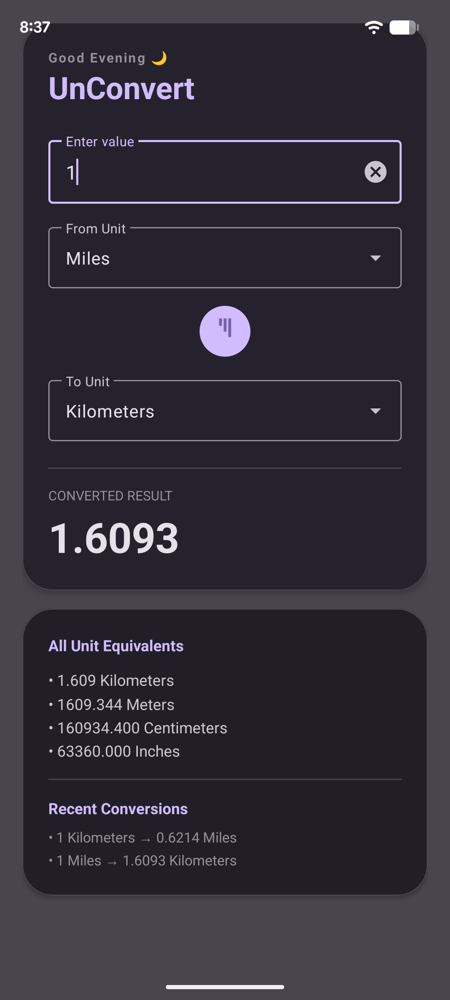

# UnConvert 🚀

A high-performance, native Android utility application designed to deliver instant, real-time length conversions with a modern Material 3 interface and advanced user experience enhancements.

---

### 👨‍💻 Developed By
* **Author:** **Rudra Oberoi**
* **GitHub Profile:** [@rudraoberoi10](https://github.com/rudraoberoi10)
* **Project Repository:** [UnConvert_Android](https://github.com/rudraoberoi10/UnConvert_Android)

---

## 📱 Application Preview

To give you a quick glimpse of the application in action, here is the interface design highlighting the clean Material 3 architecture and data-rich extensions:

<p align="center">
  
</p>

### 🔍 Key Visual Pillars:
* **The Main Core Card:** A sleek, elevated workspace handling text input observers and custom dropdown menus.
* **All Unit Equivalents Matrix:** The newly added lower panel that automatically computes your input across every alternative metric simultaneously.
* **Recent Conversions Terminal:** A rolling runtime stack tracking your session history dynamically.

---

Built entirely in **Java** and **XML**, **UnConvert** eliminates traditional form-submission latency by computing metrics dynamically as the user types. It optimizes screen real estate on mobile devices by integrating data-rich widgets, including a multi-unit parallel conversion matrix and a rolling session history stack.

## ✨ Features & Core Functionality

* **Instant Real-Time Calculations:** Utilizes dynamic text observers (`TextWatcher`) to trigger computation instantly on numerical inputs—eliminating clunky, manual "Convert" buttons.
* **Parallel Multi-Unit Matrix:** Dynamically displays parallel conversions across all available unit equivalents simultaneously, giving users a holistic analytical overview in a single glance.
* **Rolling Session History Tracker:** Tracks and lists recent calculations within a localized runtime stack to allow quick, seamless reference of past metrics.
* **Intuitive "Quick Flip" Swap Layout:** Integrates a responsive, haptic-guided swap action button ($\rightleftharpoons$) that instantly reverses source and target metrics for effortless back-and-forth calculations.
* **Context-Aware Greetings:** Features a dynamic, system-clock-linked header greeting that updates to match user device local time (Morning, Afternoon, Evening).
* **Material 3 Responsive UI:** Outfitted with an elegant Material Card viewport, exposed dropdown selection sheets (`AutoCompleteTextView` nested in `TextInputLayout`), and subtle alpha animation fade-ins for fluid results delivery.

---

## 🛠️ Architecture & Tech Stack

* **Language:** Java (JDK 17)
* **UI Layout:** Native Android XML (utilizing `ConstraintLayout`, `NestedScrollView`, and `Material3` design parameters)
* **Core Engineering Principles:**
  * Strict input data validation to intercept and gracefully handle invalid string formats, empty states, or trailing decimal points.
  * A unified conversion pipeline that standardizes all inputs to a baseline unit (**Meters**) before translating to target metrics to minimize floating-point drift and guarantee maximum mathematical precision.
  * Hardware-accelerated interface elements utilizing native system Window services for physical haptic event feedback (`HapticFeedbackConstants`).

---

## 📐 Supported Length Metrics

The baseline math engine supports cross-conversions between the following metrics:
* **Kilometers** ($1 \text{ km} = 1000 \text{ m}$)
* **Meters** (Baseline Reference Unit)
* **Centimeters** ($1 \text{ cm} = 0.01 \text{ m}$)
* **Miles** ($1 \text{ mi} = 1609.344 \text{ m}$)
* **Inches** ($1 \text{ in} = 0.0254 \text{ m}$)

---

## 📂 Project Structure & Key Classes

```text
app/src/main/
│
├── java/com/example/unconvert/
│   └── MainActivity.java       # Coordinates state management, input pipelines, and UI micro-interactions.
│
└── res/
    ├── layout/
    │   ├── activity_main.xml   # Material 3 scaffold, custom layout inputs, and parallel data displays.
    │   └── dropdown_item.xml   # Styled layout specifications for custom dropdown selectors.
    └── values/                 # Baseline theme styles and Material 3 design color states.
